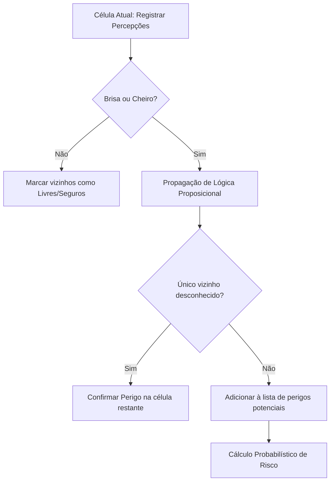

# Relatório de Implementação: Mundo de Wumpus com IA

Este documento descreve detalhadamente o desenvolvimento do simulador do **Mundo de Wumpus**, construído em Python 3 utilizando as bibliotecas Pygame, NumPy e algoritmos avançados de Inteligência Artificial para modelagem lógica e probabilística.

---

## 1. Estrutura do Ambiente e Representação do Mundo

O ambiente do jogo é implementado no módulo `ambiente.py` e gerido pela classe `Ambiente`.

### Representação do Tabuleiro
* **Matriz:** O tabuleiro é modelado como uma matriz NumPy bidimensional de dimensão $N \times N$, onde $N$ é parametrizável (mínimo $4 \times 4$).
* **Elementos:** Cada elemento ocupa uma célula da matriz de forma discreta:
  * **Vazio (0):** Célula livre.
  * **Poço (1):** Obstáculo letal estático.
  * **Wumpus (2):** Monstro letal (móvel ou estático).
  * **Ouro (3):** Objetivo do agente.
  * **Agente (4):** Posição atual do explorador.
* **Segurança Inicial:** A célula `(0, 0)` é definida como a entrada segura do agente. Para evitar derrotas imediatas inevitáveis, as posições adjacentes a `(0, 0)` – ou seja, `(0, 1)` e `(1, 0)` – são limpas de poços e Wumpus durante o posicionamento aleatório dos elementos.

### Geração Dinâmica de Percepções
O agente é dotado de sensores locais limitados à sua célula atual, simulando um ambiente **parcialmente observável**. A cada rodada, o ambiente calcula e retorna as percepções para a coordenada do agente:
* **Brisa (`brisa`):** Retorna `True` se houver um ou mais poços em células ortogonalmente adjacentes.
* **Cheiro (`cheiro`):** Retorna `True` se o Wumpus estiver em uma célula adjacente.
* **Brilho (`brilho`):** Retorna `True` se o ouro estiver na mesma célula que o agente.

---

## 2. Base de Conhecimento e Mecanismo de Inferência

A tomada de decisões do agente é centralizada no módulo `conhecimento.py`, através da classe `BaseConhecimento`.

### 2.1 Raciocínio Lógico (Proposicional)
Para poços e Wumpus estáticos, aplicamos regras lógicas proposicionais clássicas sobre as percepções obtidas nas células visitadas:
1. **Ausência de Sensor:** Se uma célula visitada não apresenta Brisa (ou Cheiro), deduz-se logicamente que todos os seus vizinhos válidos estão livres de poços (ou Wumpus):
   $$\neg Brisa(s) \implies \forall s' \in Vizinhos(s), \neg Poco(s')$$
2. **Presença e Exclusão:** Se uma célula apresenta Brisa, e todos os seus vizinhos menos um foram marcados logicamente como livres de poço, deduz-se que a célula vizinha restante é um poço confirmado:
   $$Brisa(s) \land \left(\bigwedge_{s_i \in Vizinhos(s) \setminus \{s'\}} \neg Poco(s_i)\right) \implies Poco(s')$$

### 2.2 Raciocínio Probabilístico sob Risco
Quando o agente se encontra em uma situação sem saída (nenhuma célula não visitada é classificada logicamente como $100\%$ segura), ele calcula a probabilidade de risco para todas as células da fronteira desconhecida:

1. **Risco de Poço ($P_{\text{poço}}$):**
   * Se a célula $c$ é adjacente a uma célula visitada $v$ que **não** tem brisa, $P_{\text{poço}}(c) = 0$.
   * Para cada célula visitada $v_i$ adjacente a $c$ contendo brisa:
     $$P(c \text{ é poço} \mid Brisa(v_i)) = \frac{1}{|U(v_i)|}$$
     onde $U(v_i)$ representa os vizinhos de $v_i$ ainda não visitados e não sabidos como seguros.
   * Se múltiplos sensores de brisa apontam para $c$, combinamos os riscos:
     $$P_{\text{poço}}(c) = 1 - \prod_{v_i \in VizinhosBrisa(c)} \left(1 - \frac{1}{|U(v_i)|}\right)$$

2. **Risco de Wumpus ($P_{\text{wumpus}}$):**
   * **Caso Estático:** Raciocínio análogo ao de poços com base nas fontes de cheiro.
   * **Caso Móvel:** Calculado diretamente a partir do conjunto de crenças de localização do Wumpus:
     $$P_{\text{wumpus}}(c) = \frac{1}{|Possibilidades|}$$
     se $c$ pertence ao conjunto de crenças; caso contrário, é $0$.

3. **Risco Combinado ($R$):**
   A probabilidade de falha/morte ao entrar na célula $c$ é dada pela probabilidade de haver poço **ou** Wumpus:
   $$R(c) = 1 - (1 - P_{\text{poço}}(c)) \cdot (1 - P_{\text{wumpus}}(c))$$
   O agente escolhe a célula com o menor $R(c)$.

### 2.3 Tratamento do Wumpus Móvel (Incerteza Dinâmica)
Quando a movimentação do Wumpus está ativada, a base de conhecimento implementa uma atualização de crenças no estilo filtro de Bayes discreto:
* **Representação:** É mantido um conjunto de possíveis localizações `possiveis_posicoes_wumpus`.
* **Atualização Temporal (Movimento):** A cada turno que o Wumpus se move para uma vizinhança aleatória, o conjunto é atualizado para conter todos os vizinhos das possíveis posições do turno anterior:
  $$Possibilidades_{t} = \bigcup_{p \in Possibilidades_{t-1}} Vizinhos(p)$$
* **Atualização Sensorial (Medição):** Ao visitar uma célula $s_t$:
  * Se houver cheiro: o conjunto de crenças é intersectado com os vizinhos de $s_t$.
  * Se não houver cheiro: o agente remove os vizinhos de $s_t$ e a própria célula $s_t$ do conjunto.

Se o Wumpus se mover e invalidar a segurança de uma célula pertencente ao caminho atualmente traçado pelo agente, o plano de ações é imediatamente cancelado, e o agente recalcula a rota contornando a nova área de risco.

---

## 3. Estratégia do Agente e Algoritmo de Busca

A tomada de ação (`agente.py`) segue uma máquina de estados com a seguinte prioridade estratégica:

1. **Retorno do Ouro:** Se `has_gold` é verdadeiro, o único objetivo do agente é retornar à célula `(0, 0)` usando o menor caminho seguro.
2. **Exploração Segura:** Se existem células seguras conhecidas que ainda não foram visitadas, o agente calcula a distância de Manhattan até elas e escolhe a mais próxima para traçar uma rota.
3. **Decisão sob Risco:** Na ausência de opções seguras, o agente calcula o risco probabilístico das células da fronteira e escolhe a célula desconhecida com menor probabilidade de morte.
4. **Algoritmo de Busca (A*):** Em `busca.py`, o algoritmo A* encontra a rota mais curta. Os nós visitados na busca são restritos a células que o agente provou logicamente serem seguras, com exceção da célula de destino final (que pode ser uma célula de risco). A heurística utilizada é a **distância de Manhattan**.

---

## 4. Resultados Empíricos (Simulações Headless)

Para avaliar o desempenho do agente, foi implementado um script de execução em lote (`headless.py`), que simulou $100$ partidas em um tabuleiro de dimensão $6 \times 6$ com poços gerados proporcionalmente ($\approx 4$ poços por partida):

| Métrica | Modo: Wumpus Estático | Modo: Wumpus Móvel |
| :--- | :---: | :---: |
| **Taxa de Sucesso (Vitórias)** | **87.0%** | **53.0%** |
| **Mortes por Poço** | 13.0% | 5.0% |
| **Mortes por Wumpus** | 0.0% | 42.0% |
| **Timeouts / Bloqueios** | 0.0% | 0.0% |
| **Média de Passos por Partida** | 28.8 | 20.0 |

### Análise dos Resultados
* **Wumpus Estático (87% de Sucesso):** O agente apresenta alta eficiência. Ele consegue localizar o ouro e retornar com segurança na grande maioria das vezes. As únicas derrotas ocorrem devido ao posicionamento dos poços (ex: ouro cercado por poços, obrigando a exploração sob risco que resulta em queda). Como o Wumpus é estático e o cheiro é permanente, a taxa de morte por Wumpus foi de $0\%$.
* **Wumpus Móvel (53% de Sucesso):** O comportamento móvel introduz grande dinamismo e imprevisibilidade. A taxa de morte pelo Wumpus sobe para $42\%$, refletindo situações onde o monstro se moveu diretamente na direção do agente ou onde o agente foi encurralado devido às restrições do tabuleiro.

---

## 5. Dificuldades Encontradas e Lições Aprendidas

1. **Revisão Dinâmica de Crenças:** A maior complexidade residiu em lidar com a invalidação de caminhos "seguros" previamente traçados. A solução de disparar um gatilho de replanejamento sempre que o Wumpus se move e novas percepções aparecem mostrou-se eficiente.
2. **Cálculo da Probabilidade em Malhas Cíclicas:** A simplificação do cálculo de risco combinando independentemente os sensores vizinhos foi uma abordagem pragmática essencial. Um cálculo Bayesiano completo exigiria construir uma rede de Bayes para o tabuleiro inteiro, o que seria computacionalmente proibitivo para simulações interativas em tempo real.
3. **Controle de Interface Pygame:** Gerenciar a taxa de atualização física da simulação (em passos por segundo) separadamente da taxa de quadros (60 FPS) da interface gráfica foi fundamental para manter animações fluidas e a responsividade do teclado.
